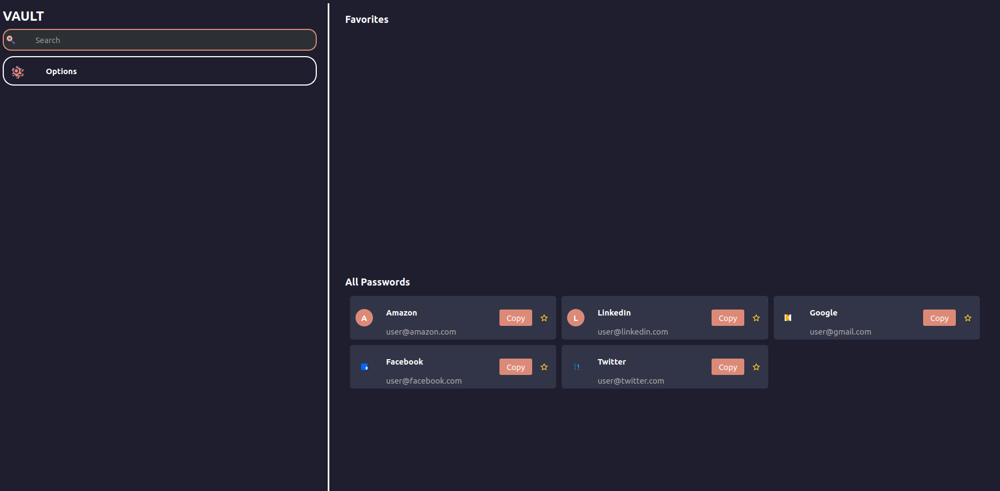
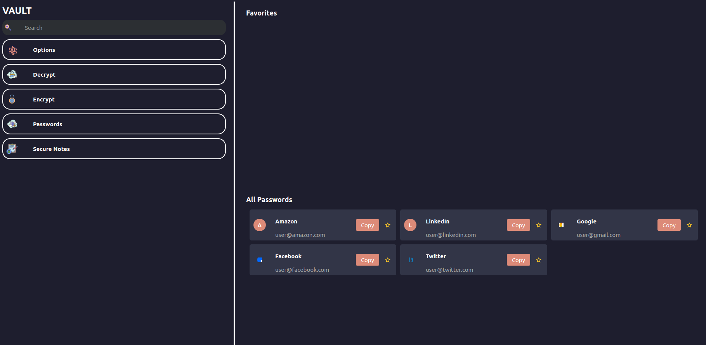

# Login Page


# Main Page
<p float="left">
    
    
</p>

# Encryption Page


# Algorithms
Currently being designed and tested in the backend. Eventually, will be usable 
in the GUI once most the alogirthms are correctly implemented and password 
managing is completed and well tested.

# Purpose
Create a password manager with RSA Encryption to properly store my personal 
passwords locally. Project will also aid in understanding core encryption algorithms. 
Additionally, I will learn about making cross platform applications, allowing me
and users to securly store passwords.

# Tools
```bash
# QT Tools
> sudo apt install qt6-base-dev

# Boost multiprecision library
> sudo apt-get install libboost-all-dev
```

# Compilation
Recommended:
```bash
> make
> cd build
```

Alternitavely:
```bash
> mkdir -p build
> cd build
> cmake ..
> make
```

# Execution
```bash
> ./vault
```

# Dates
Start: July 2024
End: Till Death

# Contributors
Victor Perez Contreras
