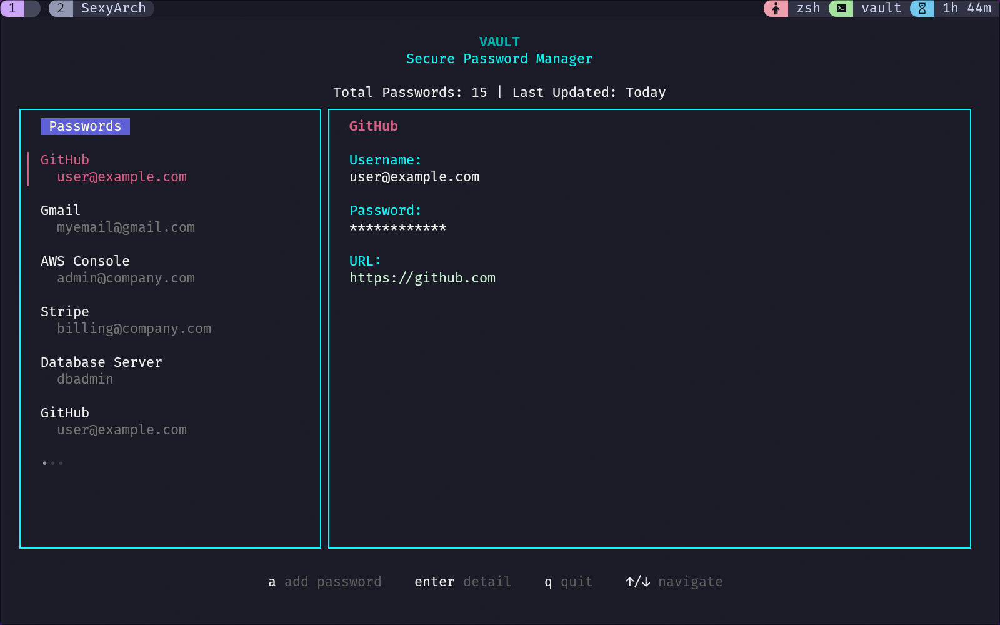
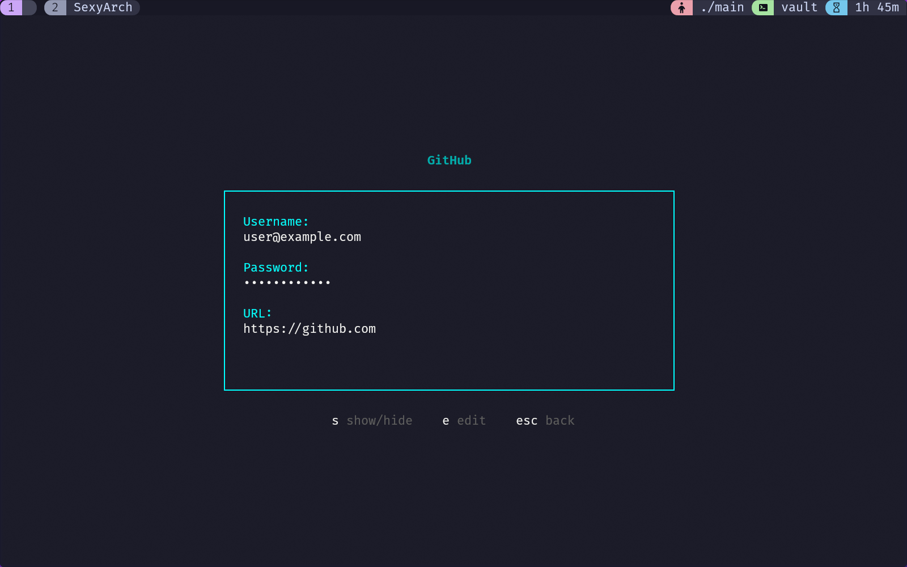

# Vault




# Purpose
*Vault* is a Hardware based Password Manager. Vault performs this by 
running Ubuntu Server LTS on a Raspberry Pi (RP). This allows for 
passwords to be hardware contained. Additionally, this offers the 
power of modular encryption. This is done by allowing the user to 
configure what Multi Factor Authentication (MFA) devices they want 
to work with. For instance, if a user wishes to enable fingerprint 
and token authentication it will be allowed.

Vault will allow for this through a modular configuration in the 
CAD design. Vault allows for slideable modules that attach through 
USB-C. This allows the user to attach modules if they wish. For 
instance, if a user wishes to install fingerprint they would gather 
the materials (fingerprint sensor, CAD design, and wiring), solder 
and build the module, then they can attach things to their Vault. 
This design takes inspiration from industry leader Framework who is
leading the way in repairable hardware.

# Dependencies

In order to run Vault these must be installed:

```bash
# Note: package manager and package names may differ on your system
> yay -S qt6-base-dev go
```

# Compilation
Recommended:

```bash
> mkdir -p build
> cd build
> cmake ..
> make -j`nproc`
```


Alternatively:

```bash
> make
> cd build
```

# Execution
```bash
> ./vault
```

# Future Development
## CAD Design
In Development.

## Modules
For now Vault aims at supporting a two modules: fingerprint and token
authenticator. The fingerprint sensor is still be tested and made to 
work with Vault. The token authenticator will be a keypass with Duo 
Mobile or another authenticator application that is easy to enable.

# Dates
Start: July 2024

End: Till Death

# Contributors
Victor Perez Contreras
